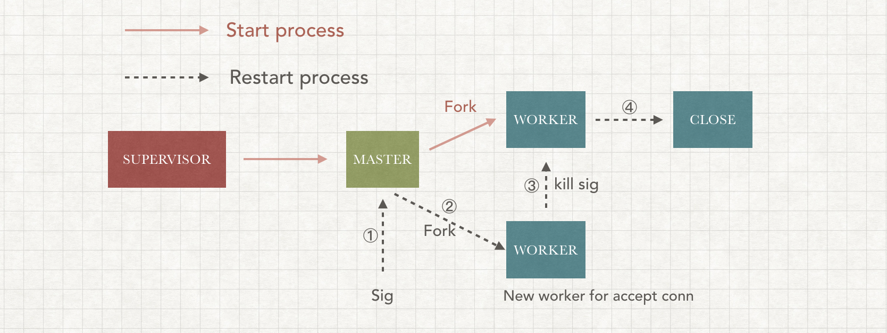

# go-graceful

[](https://goreportcard.com/report/github.com/rrylee/go-graceful)

Inspired by [graceful](https://github.com/kuangchanglang/graceful) and [overseer](https://github.com/jpillora/overseer), for support some framework.

\>= go1.8

### Feature

* multi service, port
* worker with framework
* support supervisor, systemd
* connection limit



use master-worker model because supervisor should keep master pid.

### Example

std http server
```go
type myHandler struct{}
func (*myHandler) ServeHTTP(w http.ResponseWriter, _ *http.Request) {
	_, _ = w.Write([]byte(fmt.Sprintf("Hello world, pid = %d, ppid=%d", syscall.Getpid(), syscall.Getppid())))
}

func main() {
	mux := http.NewServeMux()
	mux.Handle("/", &myHandler{})

	srv := &http.Server{Handler: mux}

	grace := graceful.New()
	grace.RegisterService(graceful.NewAddress("127.0.0.1:8124", "tcp"), func(ln net.Listener) error {
		return srv.Serve(ln)
	}, func() error {
		return srv.Shutdown(context.Background())
	})

	grace.Run()
	err := grace.Run()
	if err != nil {
		log.Fatal(err)
	}
}

```

use iris

```go
app := iris.New()

app.Get("/", func(c context2.Context) {
    _, _ = c.Writef("hello world! pid=%d, ppid=%d", syscall.Getpid(), syscall.Getppid())
})

grace := graceful.New()
grace.RegisterService(graceful.NewAddress("127.0.0.1:8124", "tcp"), func(ln net.Listener) error {
    return app.Run(iris.Listener(ln))
}, func() error {
    return app.Shutdown(context.Background())
})
err := grace.Run()
if err != nil {
    log.Fatal(err)
}
```
